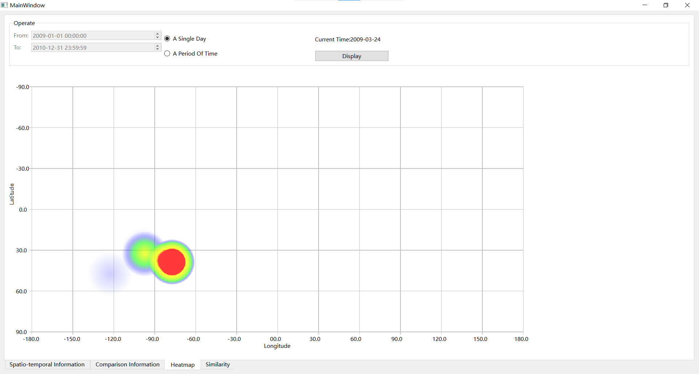

## Build
 On Windows system, use qmake to build the source code. 
 Compiler:MinGW 8.1.0 64-bit for C++
 Qt version:Qt 6.2.1 MinGW 64-bit
 QChart is needed
 The path of the source code should not contain Chinese characters.

 The application has also been packaged. Enter the `Application` file and run `Project.exe` on Windows System, you can directly run the application.

 ## Run

Click the button `Open...` and select `gowalla.csv`. You can choose the fields you are interested in. But you'd better choose all fields, otherwise many functions will not work. Finally click the button `OK` to evoke the main window.

### Spatio-temporal Information

It is recommended to maximize the MainWindow.
In this view, you can choose one of the four funations and adjust the corresponding parameters. Then click the button `Display`. A chart will appear below. If you choose `A Ste Of POIs`, you can drag the chart to change the Loaction_id.

### Comparison Information

In this view, you can choose one of the two funations and adjust the corresponding parameters. Then click the button `Display`. A chart will appear below. If you enlarge the chart, click the button `Resize`. Then the chart will revert to its original size.

### Heatmap

In this view, you can choose one of the two funations and adjust the corresponding parameters. Then click the button `Display`. A heatmap will appear below. If you choose `A Single Day`, click the heatmap to display the next day.

### Similarity

In this view, you can choose one of the two funations and adjust the corresponding parameters. Click the button `Computing Similarity` to display the similarity with words. Click the button `Display graphially` to display the comparison result graphially. 

